<div align="center">

# Z I O N S &nbsp;&nbsp; L I E D E R B U C H

**705 hymns, one consistent Keynote design — automated pptx → Keynote conversion**

<sub>German hymnal · Keynote presentations · one slide per verse</sub>

<sub>D e s i g n e d&nbsp;&nbsp;b y&nbsp;&nbsp;S e r g i o</sub>

<br>


<br>

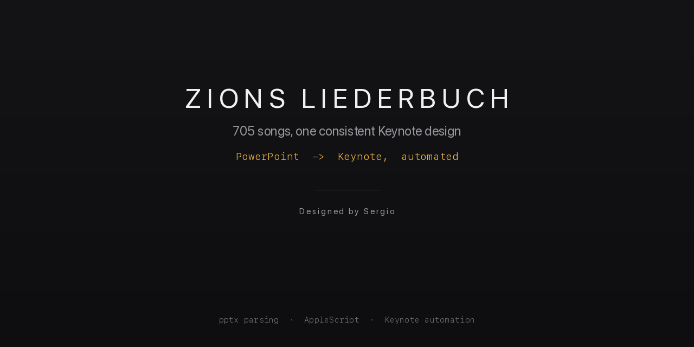

<br><br>


<br><sub>A hymn playing through — cover, verse, refrain, verse</sub>

<br><br>

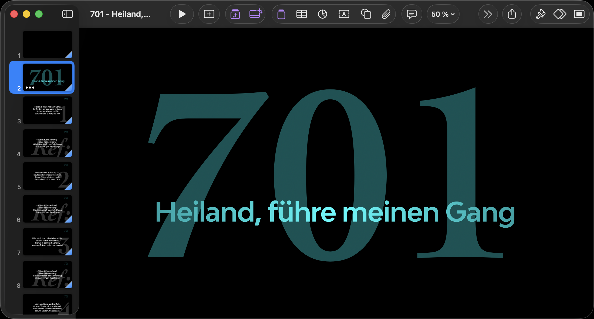
<br><sub>Cover — the number set large, the title across it</sub>

<br><br>

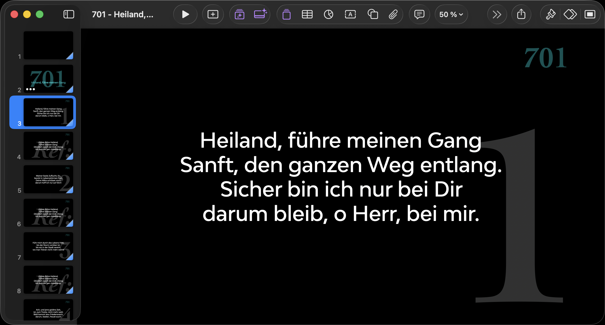
<br><sub>Verse 1 — the verse number sits behind the text as a watermark</sub>

<br><br>

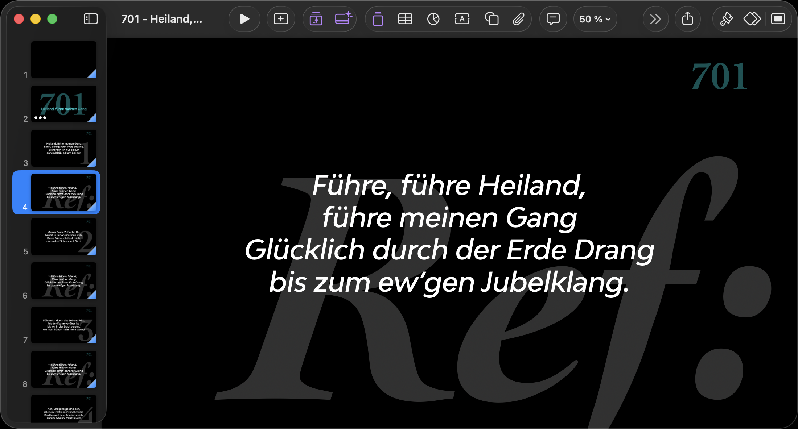
<br><sub>Refrain — the oversized <i>Ref:</i> mark sets it apart from a verse at a glance</sub>

<br><br>

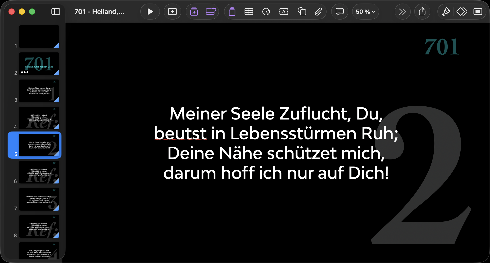
<br><sub>Verse 2 — same layout, so the whole book reads identically</sub>

<br><br>

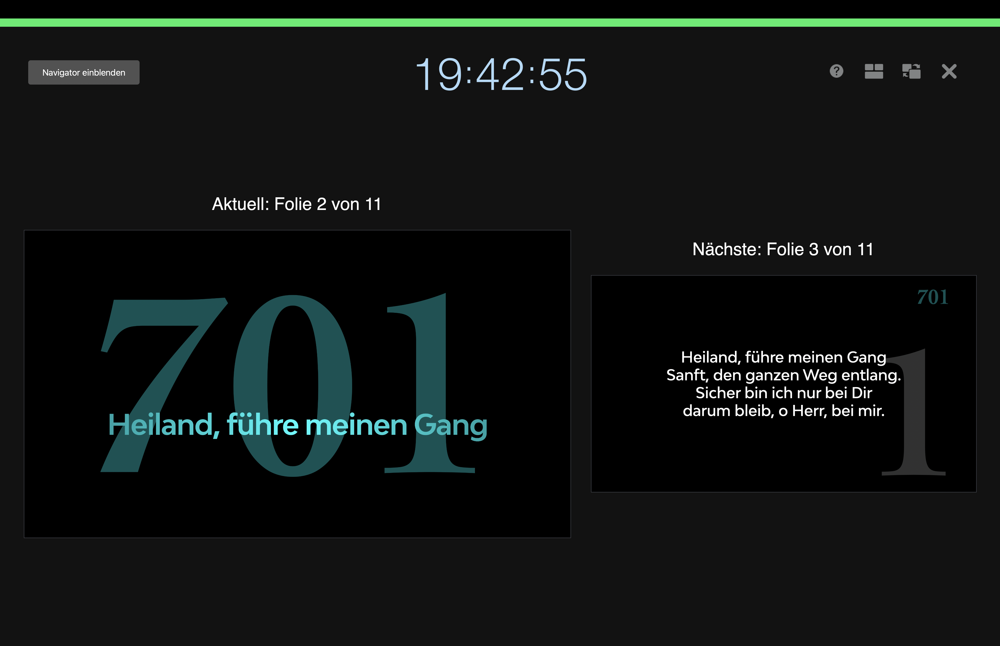
<br><sub>Presenter view — current slide, what is coming next, and the clock</sub>

<br><br>

### On the actual screen

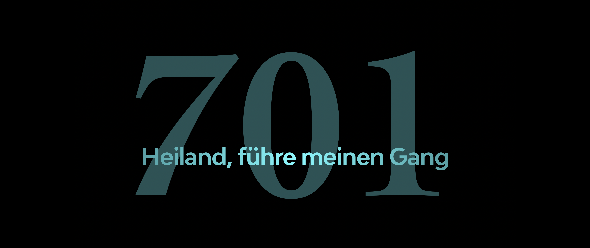
<br><sub>Ultrawide display (21:9) — cover</sub>

<br><br>

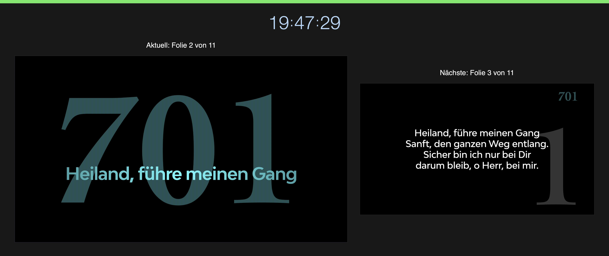
<br><sub>Ultrawide display (21:9) — verse</sub>

<br><br>

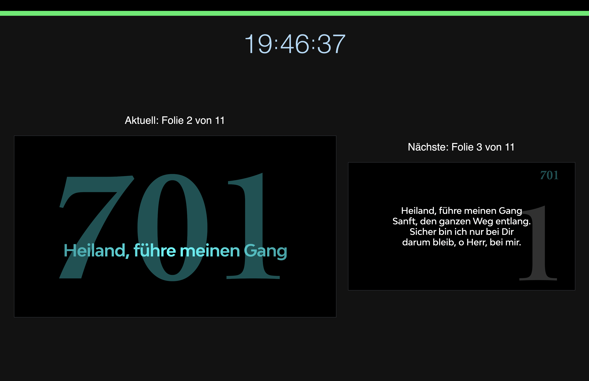
<br><sub>Standard display — cover</sub>

<br><br>

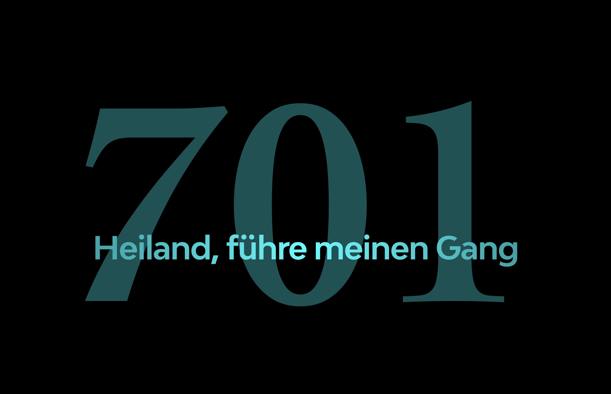
<br><sub>Standard display — verse</sub>

<br><br>

<table>
<tr>
<td align="center">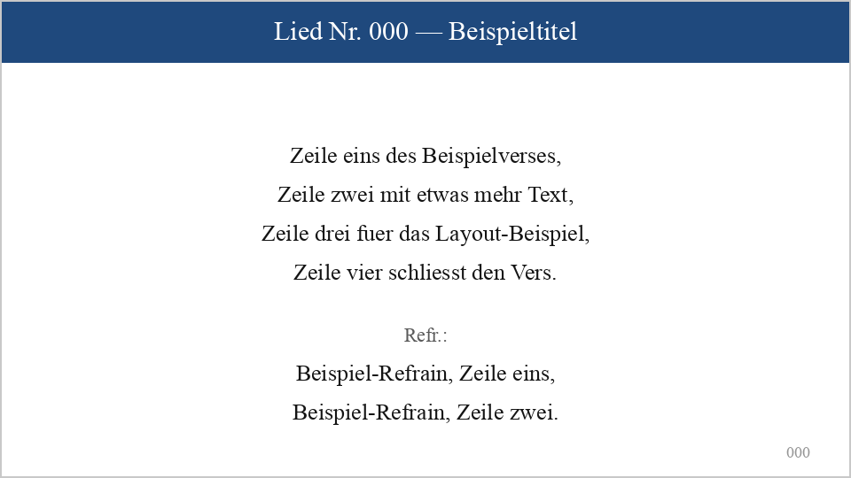</td>
<td align="center">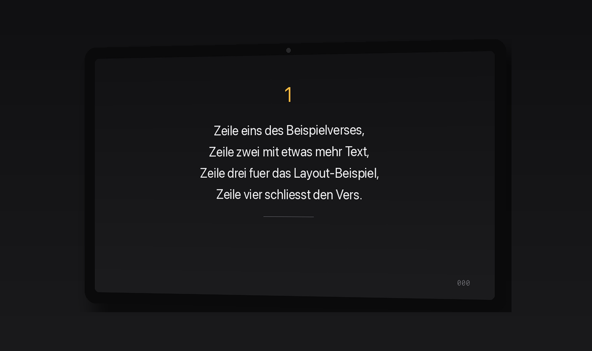</td>
</tr>
<tr>
<td align="center"><sub>Before · PowerPoint, decades of inconsistent formatting</sub></td>
<td align="center"><sub>After · one Keynote template, applied automatically</sub></td>
</tr>
</table>

</div>

<br>

## What this is

A German hymnal (*Zions Liederbuch*, 705 songs) that existed as decades of hand-built `.pptx` files — inconsistent fonts, layouts, and slide structure depending on who built which song and when. This project reads each old `.pptx`, extracts number / title / verses / refrain, and rebuilds it as a `.key` file from one single template, so the whole hymnal presents consistently.

**All 705 hymns converted and verified.**

- **[Browse the full song index →](SONGS.md)** — every hymn by number and title, searchable
- **[Download the presentations →](../../releases)** — Keynote files, split into parts of ~100 hymns

## How it works

- `scripts/convert_song.py <number>` — finds the matching `.pptx`, parses it (`python-pptx`), builds the `.key` from the template via AppleScript/Keynote automation, then re-opens the result and asserts every slide matches what was asked for.
- `scripts/make_song.py` — the actual slide-building logic: duplicates/removes verse+refrain slide pairs to match the song's real verse count, fills in text, handles the "no refrain" case by dropping the refrain slides entirely and renumbering.
- `scripts/batch_convert.py` — drives a list of song numbers through the above, with a lockfile against double-launching and a configurable Keynote-restart cadence.

## Findings from getting this to run reliably

`#macOS` `#AppleScript` `#Keynote` `#automation` `#python-pptx` `#debugging`

- **`#autosave-trap`** — Keynote autosaves *in place*, and its own AppleScript "save as" doesn't reliably re-home that target. Fix: never let Keynote open the template directly — `cp` it to the output path on disk *first*, then open the copy. Keynote's autosave then has nowhere to land but the copy.
- **`#scripting-scope`** — AppleScript handlers need their own `tell application` block; Keynote-specific terms (`text items`, `object text`) used outside one fail to compile with a misleading error pointing at the wrong token.
- **`#not-actually-apple`** — the app answering to Keynote's bundle identifier on this Mac turned out to be a repackaged, third-party-signed build, not one from the App Store — explains a chunk of the instability under sustained automation below.
- **`#state-not-memory`** — a batch of 79 songs that failed identically at "restart Keynote every 4 songs" each succeeded individually in total isolation. Diagnosis was wrong the first time (blamed memory growth); the real cause was state left behind by the *previous* song in the same session, not accumulated bloat. Fix: restart before every single song for the final cleanup pass.
- **`#off-by-one`** — an automated verification pass had its own bug (checking slide N+1 against the data for slide N) that made *correct* output look broken. Lesson: verify the verifier, especially before trusting it to flag good work as bad.

## Requirements

- macOS with Keynote
- Python 3.9+, `python-pptx`

## Usage

```bash
cd scripts
python3 convert_song.py 141              # one song, by number
python3 batch_convert.py                  # everything listed in remaining_numbers.txt
```

## Support & Contact

[](mailto:gssdarm@gmail.com)
[](https://t.me/ohnedan)
[](https://github.com/TheMaestr-o)
